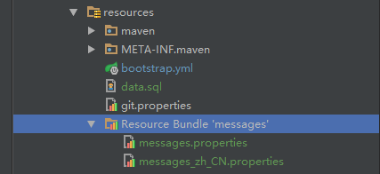
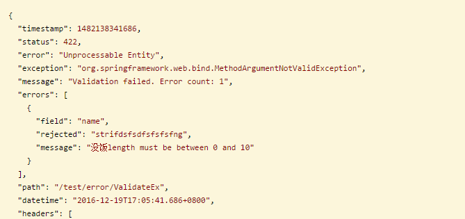
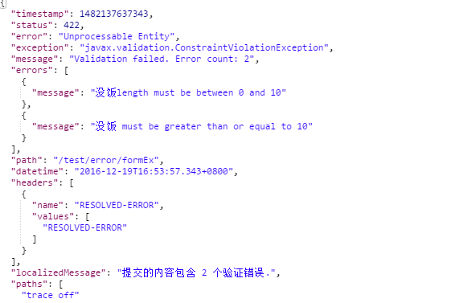

# JSR-303&349的i18n配置

<!-- vim-markdown-toc GFM -->
* [简介](#简介)
* [Resource Bundle](#resource-bundle)
* [JSR-303 i18n配置](#jsr-303-i18n配置)
* [JSR-349 i18n配置](#jsr-349-i18n配置)
* [例子](#例子)
  * [JSR303](#jsr303)
  * [JSR349](#jsr349)
* [自定义constraint及应用](#自定义constraint及应用)
  * [Constraint](#constraint)

<!-- vim-markdown-toc -->

## 简介
+ JSR 303 - Bean Validation 是一个数据验证规范，在jdk1.6及以上应用程序中，通过使用Bean Validation或是自定义的constraint，可以确保数据模型的正确性。
+ JSR 349 - Bean Validation 1.1 在它基础上增加对于方法入参及方法返回值的验证。
+ Hibernate validator 4.x 是JSR-303的标准实现，Hibernate validator 5.x 增加了对JSR-349的支持。
+ Spring 3.0 及以上支持Bean Validation  ,spring 4.0 及以上支持Bean Validation 1.1 。下面可以看到集成的示例。

## Resource Bundle
+ 在main/resources目录下建立Resource Bundle,命名为messages,如图:

+ messages中的属性命名是按照Bean Validation的注解来写，定义在messages中的属性会把对应的hibernate validator的消息转译重载。

> + 等号左边的消息值固定，可以参照hibernate validator的实现
> + el表达式可以在等号右边的消息中应用。{***}的格式，括号中的值即为注解中定义的方法名。

## JSR-303 i18n配置
在应用中加入如下配置:
     
     
     @Configuration
     public class ValidationConfig extends WebMvcConfigurerAdapter {
         
         public MessageSource reloadableMessageSource() {
             ReloadableResourceBundleMessageSource messageSource = new ReloadableResourceBundleMessageSource();
             messageSource.setBasename("messages");
             return messageSource;
         }
         
         @Override
         public Validator getValidator() {
             LocalValidatorFactoryBean validatorFactory = new LocalValidatorFactoryBean();
             validatorFactory.setValidationMessageSource(reloadableMessageSource());
             return validatorFactory;
         }
     }

> + 图中messages和建立的Resource Bundle 的前缀名称一样。
> + LocalValidatorFactoryBean仅是代理，项目需要引入Bean Validation和Hibernate validator的依赖。

## JSR-349 i18n配置
1. 在应用中加入如下配置：

        @Configuration
        public class ValidationConfig {
    
            public MessageSource reloadableMessageSource() {
                ReloadableResourceBundleMessageSource messageSource = new ReloadableResourceBundleMessageSource();
                messageSource.setBasename("messages");
                return messageSource;
            }
        
            @Bean
            public LocalValidatorFactoryBean getLocalValidator(){
                LocalValidatorFactoryBean validatorFactory = new LocalValidatorFactoryBean();
                validatorFactory.setValidationMessageSource(reloadableMessageSource());
                return validatorFactory;
            }
    
            @Bean
            public MethodValidationPostProcessor methodValidationPostProcessor(javax.validation.Validator validator) {
                MethodValidationPostProcessor validationProcessor = new MethodValidationPostProcessor();
                validationProcessor.setValidator(getLocalValidator());
                return validationProcessor;
            }
        }
    
> + LocalValidatorFactoryBean 需要先配置成bean，然后在MethodValidationPostProcessor 中设置。
> + **不可以直接在方法里创建，LocalValidatorFactoryBean 继承了 InitializingBean，我们需要afterPropertiesSet()方法提供的一些默认设置和ValidatorFactory。**

2.在需要使用的Controller类上加上@Validated

## 例子
### JSR303
1. 首先定义数据类User，@Length约束name的长度不超过10，如下所示:

        @Entity
        @Data
        public class User {
    
            @Id
            @GeneratedValue
            private Long id;
    
            @Column(nullable = false, length = 20)
            @Length(max = 10)
            private String name;
    
            @Column(length = 10)    
            rivate String password;
        }    
       
2. 在controller定义接受post请求的方法，入参为User，如下所示：

        @PostMapping("/ValidateEx")
        public ResponseEntity testValidateException(@Valid @RequestBody User user) {
            return new ResponseEntity(user, HttpStatus.OK);
        }        
    
3. 故意传入超过限制的数据，会返回报错,如图所示:

> **可以看到，返回了本地配置的message**

### JSR349
1. 在controller方法的入参上加上validation注解，后面跟着@RequestParam,如下所示:

            @PostMapping(value = "/formEx", consumes = MediaType.MULTIPART_FORM_DATA_VALUE)
            public ResponseEntity testFormValidateException(@Length(max = 10) @RequestParam("name") String name, 
                    @Max(10) @RequestParam("password") String password) {
                return new ResponseEntity(HttpStatus.OK);
            }

2.传入不符合约束的参数，response如图:

 **返回了自定义的message**

## 自定义constraint及应用

###  Constraint
1. 首先自定义注解，如下所示:

        @Target({ElementType.FIELD, ElementType.PARAMETER, ElementType.ANNOTATION_TYPE})
        @Retention(RetentionPolicy.RUNTIME)
        @Constraint(validatedBy = UserValidator.class)
        @Documented
        public @interface UserNotExist {
    
          String message() default "{cn.home1.oss.quickstarter.Validation.UserNotExist.message}";

          Class<?>[] groups() default {};
    
          Class<? extends Payload>[] payload() default {};
    
          long ExpectedId() default 0L;
        }    

> + message default 的值就是错误消息转译的bundle中等号左边的值
> + @Constraint 的balidateBy用来指定那个类来处理验证流程

2. 实现UserValidator类，如下所示:

        @Slf4j
        public class UserValidator implements ConstraintValidator<UserNotExist, Long> {

        @Autowired
        private UserRepository userRepo;

        private long ExpectedId;
    
        public void initialize(UserNotExist constraint) {
            ExpectedId = constraint.ExpectedId();
        }

        public boolean isValid(Long value, ConstraintValidatorContext context) {
          return userRepo.exists(value) || value == ExpectedId;
        }
        }
> + initialize方法中可以取到注解定义的方法值
> + 因为spring提供了代理，所以UserValidator类中可以使用@Autowired注入bean，使得验证功能变得更强大。

3. 使用方式如下所示:

        @Entity
        @Data
        public class User {
        @Id
        @GeneratedValue
        @UserNotExist(ExpectedId = -666L)
        private Long id;
or

        @GetMapping("/CustomParamEX")
        public void testJSR349CustomException(@UserNotExist @RequestParam("id") long id) {}

  + 本例中指定了类型为字段，注解，参数。
  + 分别进行类字段验证和方法入参验证时，均可以根据message default 匹配到前面创建的bundle中相应的属性。
